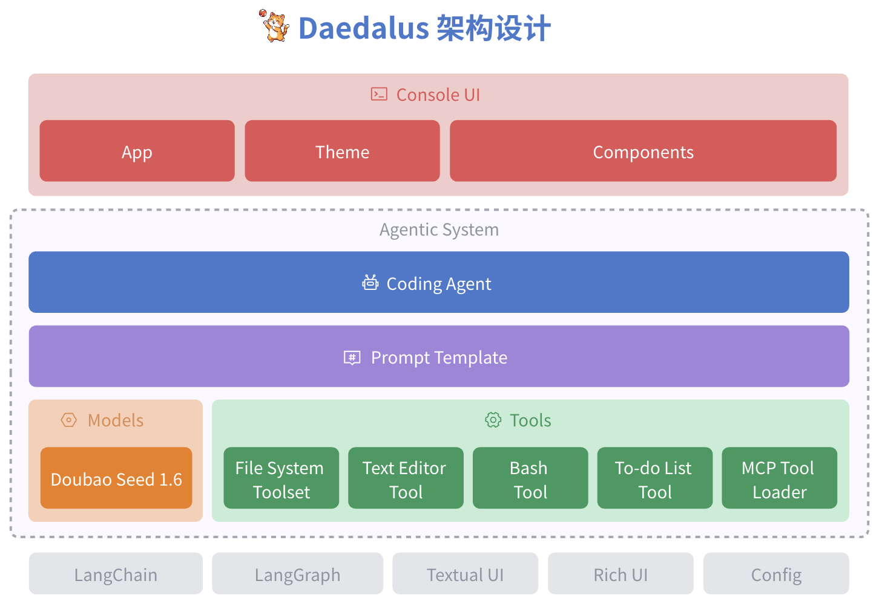

# Daedalus
An agent harness implementation built from scratch

# Architecture Design 

As shown in the diagram above, viewed from bottom to top:
- The main third-party libraries used include:
  - Agentic System is based on the upcoming official release of LangChain + LangGraph 1.0
  - The console interface is built on the Textual and Rich UI libraries
- The model layer uses Doubao Seed 1.6 by default, supporting both Thinking and non-Thinking modes
- The tool layer includes:
  - File system toolset:
The file system tools are partially referenced from Claude Code's implementation
| Tool | Description |
|------|-------------|
| ls | List subdirectories and files in a specified path, supports Glob fuzzy query, can be used for file enumeration and fuzzy filename search |
| tree | List all descendant directories and files in a specified path, supports custom depth (maximum depth of 3 layers). This tool helps Coding Agents understand project structure and technology stack |
| grep | Almost identical to the OS grep command, used for code text search via string and Glob matching, very practical for code localization |
| glob (deprecated) | Some Coding Agents also implement the glob tool, which has been merged into the ls tool in this solution design. |
  - Text editor tool:
The text editor is a single tool that supports 4 subcommands, fully referenced from Anthropic's text_editor_20250728 implementation. Both Doubao and other models are very familiar with this abstraction
| Command | Description |
|---------|-------------|
| view | Inspect file content or list directory content, can read entire files or specific line ranges |
| create | Used to create new files with specified content |
| str_replace | Replace specific strings in a file with new strings. Used for precise edits |
| insert | Insert text at a specific position in the file |
| undo (deprecated) | Since models cannot fully understand the scope of each undo action, Anthropic eventually removed this tool, and it is also removed in this solution. |
  - Command line tool: Used to execute Bash commands, also referenced from Anthropic's bash tool implementation
  - To-do list tool: Allows Agents to actively create and continuously update To-do lists. This tool itself has no practical functionality, it is a "Pseudo Tool" designed only to continuously "inspire" the Agent to carry out the Planning process.
  - MCP tool loader: Used to load MCP tools specified in config.yaml
- Prompt Template is used to manage and instantiate system prompt templates
- The Agent layer builds a Coding Agent based on the above capabilities
- Finally, in the form of Console UI, the capabilities of the Coding Agent are assembled to interact with the user

Why do Coding Agents prefer Console UI design so much?
You may wonder, why do almost all Coding Agents uniformly choose command-line CUI (Console UI) and CLI (Command Line Interface)?
- Lightweight and low development cost: Compared to Graphical User Interfaces (GUI), Console UI does not need to handle complex window management, button rendering, event listening, etc. With simple layout that maintains a certain "programmer aesthetic", development efficiency is much higher.
- Cross-platform compatibility: The terminal is almost the "common language" of all development environments. Whether it's Linux, macOS, or Windows, command lines can run on all of them.
- Suitable for continuous development and integration workflows: Can be easily integrated into CI/CD pipelines.
- Portability and low resource consumption: Console UI has extremely low memory and CPU usage, making it very suitable for running on remote servers, containers, or embedded devices, and can also be controlled remotely via SSH commands.
- Progressive enhancement: You can first implement an MVP with Console UI, then launch IDE plugins, web interfaces, desktop apps, etc. later.
